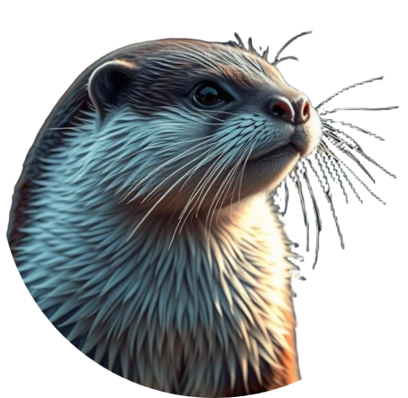

    

<h1 align="center">
    OTTER
</h1>
<h2 align="center">
    Observation and Tracking Technology for Environmental Recognition
</h2>

# Introduction

A machine learning tool to predict the presence and density of woodland creatures images taken by trail cameras.
This data is taken from three trail cameras in Kansas throughout the year.

The project is broken into two pieces. The first piece is based on machine learning, and is used to predict which 
woodland animals are in which scenes. The second portion is based on computer vision, used to determine *where* the
creatures are in each scene.